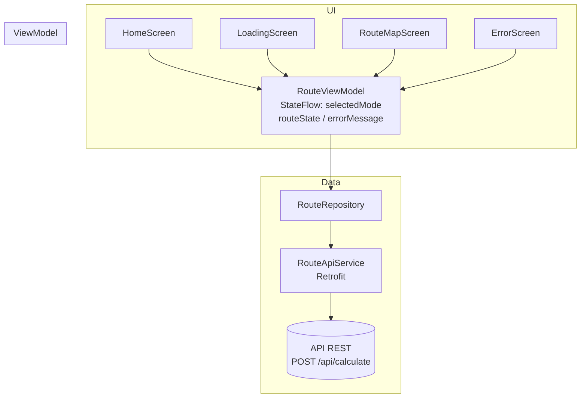
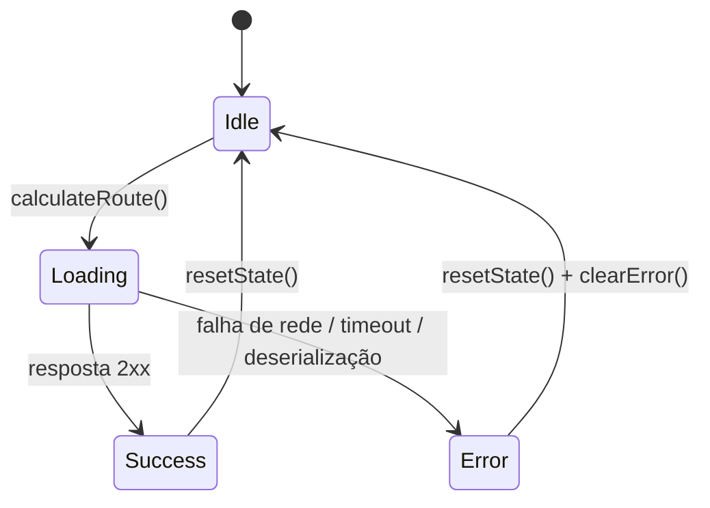

# Arquitetura — OptiRout Android

O aplicativo segue o padrão **MVVM (Model-View-ViewModel)** com separação em camadas bem definidas: `data`, `viewmodel` e `ui`. A navegação é gerenciada pelo Jetpack Compose Navigation, e o estado global da requisição é mantido em um `SharedViewModel` instanciado no escopo do `NavGraph`.

---

## Camadas

```
ui/
├── navigation/   → NavGraph (rotas + transições)
├── screens/      → Composables das telas
└── theme/        → MaterialTheme (dark)

viewmodel/
└── RouteViewModel → StateFlow compartilhado entre telas

data/
├── model/        → Data classes + enum TransportMode
├── network/      → Retrofit (ApiClient + RouteApiService)
└── repository/   → RouteRepository (único ponto de acesso à API)
```

---

## Diagrama de camadas



---

## Fluxo de estado

O `RouteViewModel` expõe três `StateFlow`:

| Flow | Tipo | Descrição |
|---|---|---|
| `selectedMode` | `TransportMode?` | Modal selecionado (default: `AUTO`) |
| `routeState` | `RouteState` | Idle / Loading / Success / Error |
| `errorMessage` | `String?` | Mensagem de erro para exibição |



---

## Modelo de dados da API

### Request

```json
{
  "origin": [-8.0623949, -34.8737916],
  "destination": [-8.1179317, -34.8999959],
  "initialMode": "auto"
}
```

### Response (simplificado)

```
RouteResponse
├── edges[]     → segmentos primitivos com geometry (lista de coords)
├── segments[]  → agrupamento de edges por modal (usado nos cards)
└── summary     → totais: tempo, distância, custo, velocidade, risco
```

---

## SharedViewModel — escopo e ciclo de vida

O `RouteViewModel` é instanciado **uma única vez** dentro de `OptiRoutNavGraph` via `viewModel()`. Como `OptiRoutNavGraph` é chamado diretamente de `MainActivity`, o ViewModel fica vinculado ao escopo da Activity, garantindo que `HomeScreen`, `LoadingScreen`, `RouteMapScreen` e `ErrorScreen` compartilhem exatamente a mesma instância sem necessidade de passagem por argumentos de navegação.
