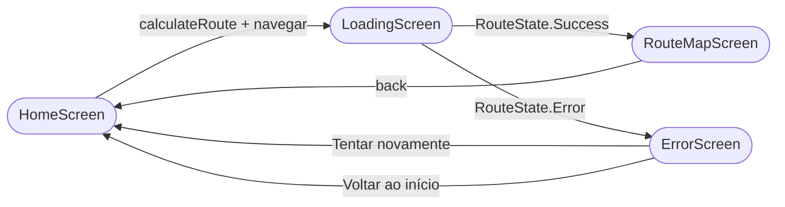

# Telas — OptiRout Android

O app possui quatro telas gerenciadas pelo **Compose Navigation** com animações de slide horizontal entre transições.

---

## Fluxo de navegação

### Transições

| Direção | Animação |
|---|---|
| Avançar (HOME → LOADING → MAP) | Slide da direita + fade in |
| Voltar (MAP → HOME, ERROR → HOME) | Slide para a direita + fade out |

---

## HomeScreen

**Arquivo:** `ui/screens/ModalSelectionScreen.kt`

Tela inicial do app. Permite ao usuário escolher o modal de transporte e iniciar o cálculo de rota.

**Componentes:**
- Título e descrição do aplicativo
- `FlowRow` com `FilterChip` para cada `TransportMode` — distribuição natural de tamanho, centralizada
- Card de descrição do modal selecionado (atualiza ao trocar de chip)
- Botão "Calcular rota" (habilitado somente com modal selecionado)
- `SnackbarHost` para exibir erros vindos de requisições anteriores

**Estado observado:** `selectedMode`, `errorMessage`

**Estado inicial:** `TransportMode.AUTO` pré-selecionado

---

## LoadingScreen

**Arquivo:** `ui/screens/LoadingScreen.kt`

Tela intermediária exibida enquanto a requisição está em andamento.

**Comportamento:**
- Observa `routeState` via `LaunchedEffect`
- `Success` → navega para `RouteMapScreen` (removendo `LoadingScreen` da backstack)
- `Error` → navega para `ErrorScreen` (removendo `LoadingScreen` da backstack)

**Animação:** `LottieAnimation` com loop infinito carregada de `res/raw/animation_loading.json`. O tamanho do container reservado é `200.dp`.

---

## RouteMapScreen

**Arquivo:** `ui/screens/RouteMapScreen.kt`

Tela principal de resultado. Divide a tela em duas metades: mapa (superior) e cards de segmentos (inferior).

**Componentes:**

| Área | Conteúdo |
|---|---|
| `TopAppBar` | Nome do modal selecionado + botão voltar |
| Metade superior | `GoogleMap` com `Polyline` por edge |
| Metade inferior | `LazyColumn` com `SummaryCard` + `SegmentCard[]` |

**Renderização do mapa:**
- Cada `edge` da resposta gera uma `Polyline` com cor correspondente ao modal
- A câmera é ajustada automaticamente para o bounding box de todos os pontos via `LatLngBounds`
- Marcadores de origem e destino são adicionados automaticamente

**Cores por modal:**

| Modal | Cor |
|---|---|
| Moto | `#FF7043` (laranja) |
| Ônibus | `#42A5F5` (azul) |
| A pé | `#66BB6A` (verde) |
| Carro | `#AB47BC` (roxo) |
| Uber | `#FFCA28` (amarelo) |
| Outros | `#90A4AE` (cinza) |

**SegmentCard** exibe: badge colorido do modal, tempo estimado, distância, velocidade média, custo (quando > 0) e nome da linha (quando ônibus).

**SummaryCard** exibe: distância total, tempo total, custo total e velocidade média geral.

---

## ErrorScreen

**Arquivo:** `ui/screens/ErrorScreen.kt`

Tela de fallback exibida quando a requisição falha (timeout, erro de rede, falha de deserialização ou erro de API).

**Componentes:**
- Ícone `Icons.Filled.Warning` na cor `error` do tema
- Título fixo "Algo deu errado"
- Mensagem dinâmica vinda de `RouteViewModel.errorMessage`
- Botão primário "Tentar novamente" → reseta estado e volta ao início
- Botão secundário "Voltar ao início" → mesma ação
